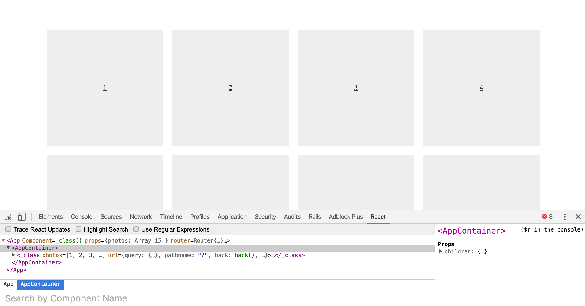

# An app done with the Next Js framework.

The aim is to have a grid of images and be able to click on each one to see individually

This is how it looks so far:

#### Todos:
- add images
- add categories (display categories)
- add mobx as a data store solution
